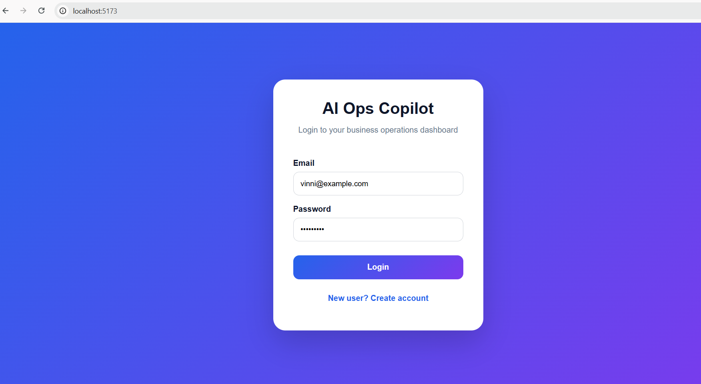
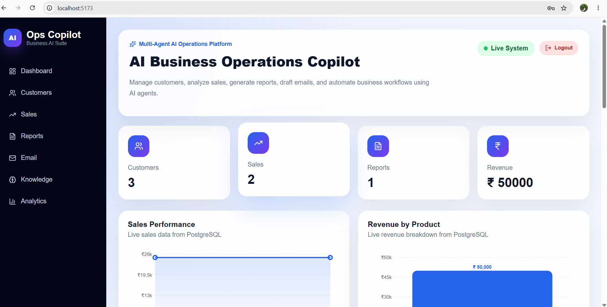
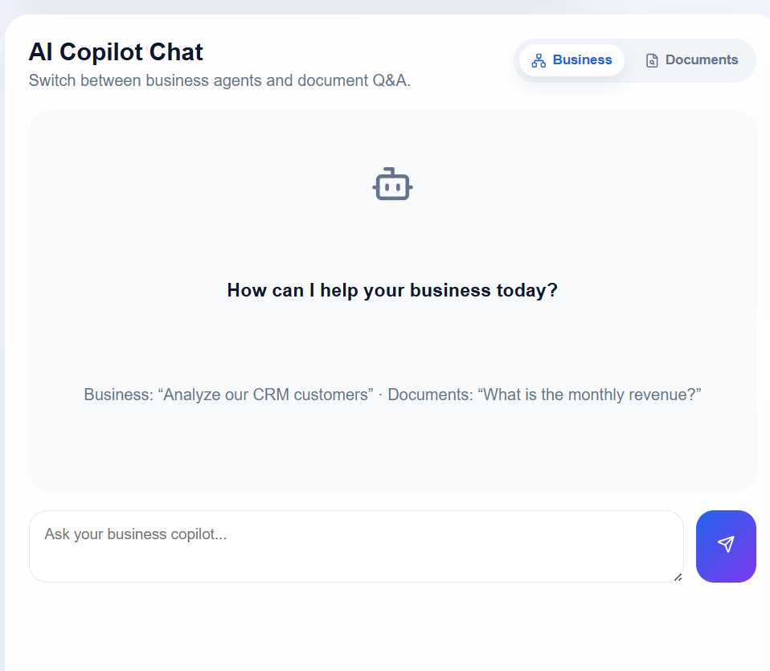
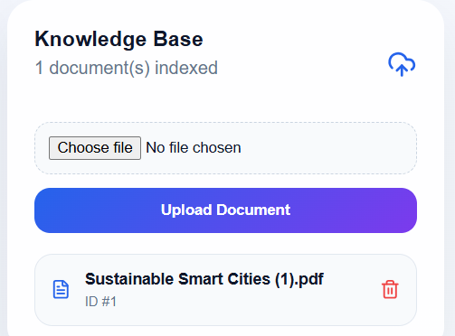
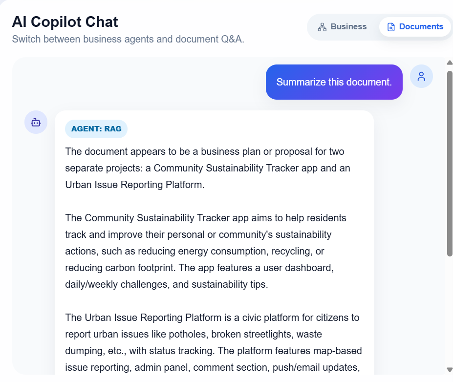
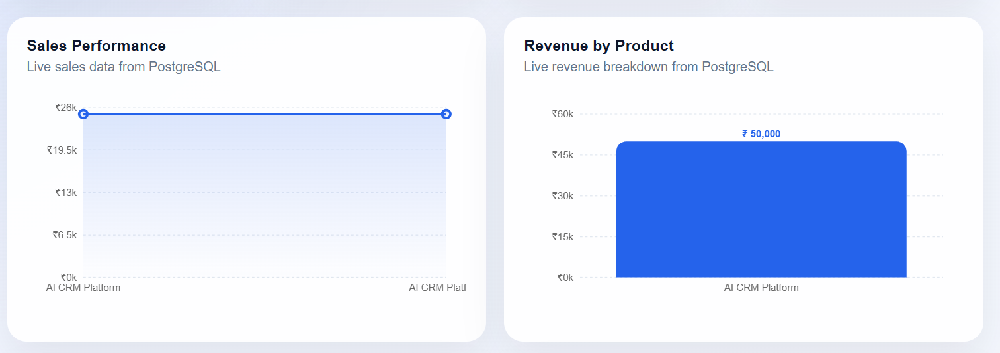

# 🚀 AI Business Operations Copilot

An enterprise-style **AI Business Operations Copilot** built with **FastAPI, React, LangGraph, PostgreSQL, pgvector, and RAG**.

This project combines **multi-agent AI**, **business analytics**, **CRM workflows**, **document intelligence**, and **secure authentication** into one full-stack AI SaaS-style application.

---

## 🌟 Project Highlights

- 🤖 Multi-Agent AI Copilot using LangGraph
- 📊 Live business dashboard with analytics
- 👥 Customer and sales management
- 📄 Document upload and RAG-powered Q&A
- 🔍 Semantic search using pgvector
- 🧠 Local embeddings using FastEmbed
- 🔐 JWT authentication
- ⚡ FastAPI backend with SQLAlchemy
- 🎨 React + Vite premium dashboard UI
- 🗄️ Supabase PostgreSQL database

---

## 📌 Overview

**AI Business Operations Copilot** is a full-stack AI application designed to help businesses manage operations, analyze sales, understand customers, generate reports, draft emails, and ask questions from uploaded business documents.

The system uses a **LangGraph Supervisor Agent** to route user requests to specialized AI agents such as:

- CRM Agent
- Sales Agent
- Report Agent
- Email Agent
- Knowledge Agent
- RAG Document Agent

This makes the application more than a chatbot — it behaves like an AI-powered business operations assistant.

---

## 🧠 Core Idea

Businesses often use separate tools for CRM, sales analytics, reporting, document search, and communication.

This project combines those workflows into one AI-powered dashboard where users can:

- View business KPIs
- Analyze customers and sales
- Upload business documents
- Ask questions from documents
- Generate business reports
- Draft professional emails
- Interact with specialized AI agents

---

# ✨ Features

## 🔐 Authentication

- User Registration
- User Login
- JWT Authentication
- Protected API Routes
- Secure Password Hashing
- Logout Functionality

---

## 🤖 Multi-Agent AI

The system includes specialized AI agents coordinated through a LangGraph Supervisor.

### CRM Agent

- Customer insights
- Customer analysis
- CRM recommendations

### Sales Agent

- Revenue analysis
- Sales trend analysis
- Business performance insights

### Report Agent

- AI-generated business summaries
- Executive reports

### Knowledge Agent

- Enterprise knowledge retrieval
- Document understanding

### Email Agent

- AI-powered email drafting
- Business communication support

### Supervisor Agent

- Routes requests to the appropriate AI agent
- Coordinates multi-agent workflows

---

# 📄 Document Intelligence (RAG)

Users can upload:

- PDF documents
- DOCX documents

The system automatically:

- Extracts document text
- Splits text into chunks
- Generates vector embeddings
- Stores vectors using pgvector
- Performs semantic search
- Answers questions using Retrieval-Augmented Generation (RAG)

---

# 📊 Dashboard Features

- Business KPI Cards
- Revenue Analytics
- Sales Analytics
- Customer Overview
- AI Insights
- Recent Activity Feed
- Interactive Charts
- AI Business Chat
- Document Q&A Chat
- Knowledge Base

---

# 🏗️ System Architecture

```text
                   React Frontend
                          │
                          ▼
                  FastAPI Backend
                          │
        ┌─────────────────┼─────────────────┐
        │                 │                 │
        ▼                 ▼                 ▼
 Authentication     LangGraph AI      RAG Engine
        │          Supervisor Agent         │
        │                 │                 │
        ▼                 ▼                 ▼
 PostgreSQL       CRM / Sales /      pgvector +
  Database       Reports / Email     FastEmbed
```

---

# 🔄 RAG Workflow

```text
Upload PDF/DOCX
        │
        ▼
Extract Text
        │
        ▼
Chunk Document
        │
        ▼
Generate Embeddings
        │
        ▼
Store in pgvector
        │
        ▼
Semantic Search
        │
        ▼
LLM Response
        │
        ▼
Answer Returned to User
```

---

# 🛠️ Tech Stack

## Frontend

- React
- Vite
- JavaScript
- CSS3
- Recharts
- Lucide React

---

## Backend

- FastAPI
- Python
- SQLAlchemy
- Pydantic
- JWT Authentication

---

## AI & RAG

- LangGraph
- FastEmbed
- pgvector
- Retrieval-Augmented Generation (RAG)

---

## Database

- PostgreSQL
- Supabase

---

## Document Processing

- PyPDF
- python-docx

---

## Development Tools

- Git
- GitHub
- VS Code
- Swagger UI

---

# 📂 Project Structure

```text
AI-Business-Operations-Copilot
│
├── backend
│   ├── app
│   │   ├── agents
│   │   ├── api
│   │   ├── core
│   │   ├── database
│   │   ├── models
│   │   ├── rag
│   │   ├── repositories
│   │   ├── schemas
│   │   └── services
│   │
│   ├── requirements.txt
│   └── .env
│
├── frontend
│   ├── src
│   │   ├── components
│   │   ├── pages
│   │   ├── services
│   │   └── assets
│   │
│   ├── package.json
│   └── vite.config.js
│
└── README.md
```

---

# ⚙️ Installation

## Clone Repository

```bash
git clone https://github.com/your-username/ai-business-operations-copilot.git
```

---

## Backend Setup

```bash
cd backend

python -m venv venv

venv\Scripts\activate

pip install -r requirements.txt

uvicorn app.main:app --reload
```

Backend:

```
http://127.0.0.1:8000
```

Swagger:

```
http://127.0.0.1:8000/docs
```

---

## Frontend Setup

```bash
cd frontend

npm install

npm run dev
```

Frontend:

```
http://localhost:5173
```

---

# 🔑 Environment Variables

Create:

```
backend/.env
```

Example:

```env
DATABASE_URL=your_database_url

SECRET_KEY=your_secret_key

ALGORITHM=HS256

ACCESS_TOKEN_EXPIRE_MINUTES=60
```

> **Note:** Never commit your `.env` file or API keys to GitHub.

---

# 📸 Application Screenshots

## 🔐 Login



---

## 📊 Business Dashboard



---

## 🤖 AI Business Copilot



---

## 📄 Knowledge Base



---

## 🔍 RAG Document Question Answering



---

## 📈 Business Analytics



---

# 🚀 REST API Endpoints

## Authentication

| Method | Endpoint |
|----------|----------------|
| POST | `/auth/register` |
| POST | `/auth/login` |
| GET | `/auth/me` |

---

## Customers

| Method | Endpoint |
|----------|----------------|
| GET | `/customers` |
| POST | `/customers` |

---

## Sales

| Method | Endpoint |
|----------|----------------|
| GET | `/sales` |
| POST | `/sales` |

---

## Dashboard

| Method | Endpoint |
|----------|----------------|
| GET | `/dashboard/stats` |

---

## Analytics

| Method | Endpoint |
|----------|----------------|
| GET | `/analytics/sales-chart` |
| GET | `/analytics/revenue-chart` |

---

## Documents

| Method | Endpoint |
|----------|----------------|
| POST | `/documents/upload` |
| GET | `/documents` |
| DELETE | `/documents/{id}` |

---

## RAG

| Method | Endpoint |
|----------|----------------|
| POST | `/rag/ask` |

---

# 🎯 Key Highlights

✅ Enterprise-style Full Stack AI Application

✅ Multi-Agent AI Architecture using LangGraph

✅ Retrieval-Augmented Generation (RAG)

✅ Semantic Search using pgvector

✅ FastEmbed Local Embeddings

✅ JWT Authentication

✅ PostgreSQL Database

✅ FastAPI Backend

✅ React Dashboard

✅ Professional UI

---

# 🔮 Future Enhancements

- Gmail Integration
- Google Calendar Integration
- n8n Workflow Automation
- AI Report Export (PDF)
- Role-Based Access Control
- Dark Mode
- Docker Deployment
- Cloud Deployment
- Team Collaboration
- Real-time Notifications

---

# 👨‍💻 Author

**Vineela Shekar**

AI Automation | GenAI | FastAPI | React | LangGraph | RAG | PostgreSQL

GitHub:
https://github.com/vineela959

---

# ⭐ Support

If you found this project useful, consider giving it a ⭐ on GitHub.

It helps others discover the project and supports future development.

---

## 📄 License

This project is licensed under the MIT License.
